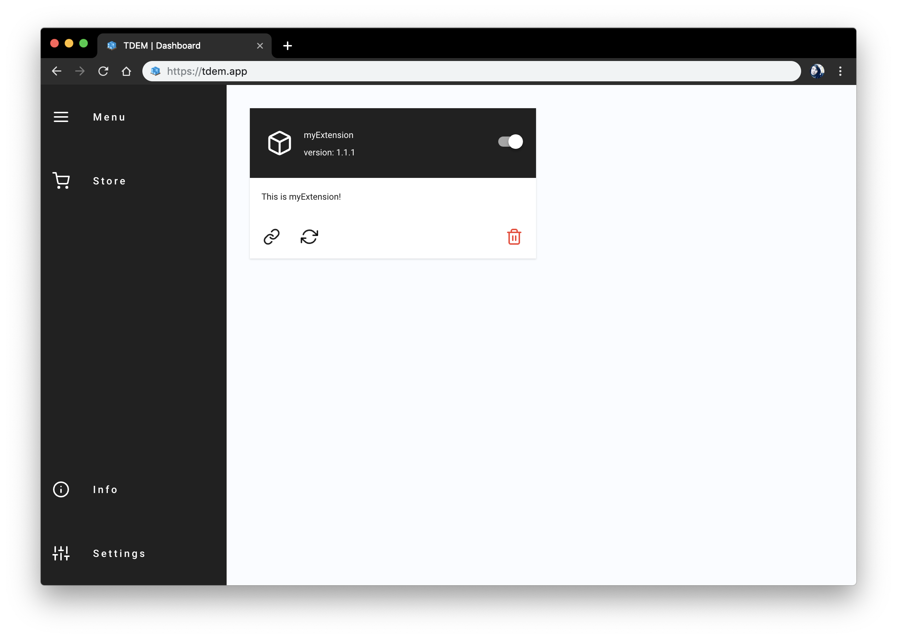

<div align='center'>

  <a href='https://github.com/tdemapp/manager/releases'>
    
  </a>

  <h1> TDEM </h1>
  <p> Install and manage extensions for TweetDeck </p>

  [](https://github.com/tdemapp/manager/blob/webpack/LICENSE) 
  [](https://travis-ci.org/tdemapp/manager) 
  [](https://prettier.io/) 
  [](https://gitmoji.carloscuesta.me/) 
  [](https://twitter.com/nurodev)

  <br />
</div>



<div align='center'>

  ## Downloads:
  
  [](https://tdem.app)
  [](https://tdem.app)
  [](https://tdem.app)

</div>

## Development:

> Clone and install dependencies
```shell
$ git clone https://github.com/tdemapp/manager.git tdem
$ cd tdem/
$ npm install # yarn
```

> Running development server
```shell
# Chrome
$ npm run dev chrome # yarn dev chrome

# Firefox
$ npm run dev firefox # yarn dev firefox
```

> Building for production
```shell
# Chrome
$ npm run build chrome # yarn build chrome

# Firefox
$ npm run build firefox # yarn build firefox
```

## License:

MIT © [Ben Dixon](https://github.com/tdemapp/manager/blob/webpack/LICENSE)
